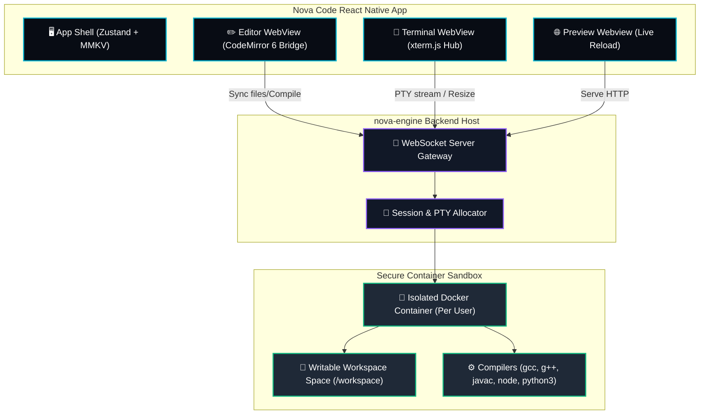

# 🌌 Nova Code — Android-First Student IDE

<p align="center">
  
  
  
  
</p>

---

## 🌟 The Product Vision

**Nova Code** is a state-of-the-art, student-focused IDE built natively for mobile. It empowers learners to write, run, debug, and preview code directly on their smartphones, removing the requirement of a desktop or laptop. By pairing a high-performance **CodeMirror 6** editor with a secure containerized execution engine (**Docker & WebSocket PTY**), Nova Code brings a complete development workspace directly to the user's pocket.



---

## ⚡ Core Features

### ✏️ High-Performance Editor Bridge
* **CodeMirror 6 Integration**: Smooth mobile text rendering, autocomplete, line numbers, word wrap, and themes (Light, Dark, High-Contrast) updating in under 300ms without WebView refreshes.
* **Smart Keyboard Accessory Bar**: Punctuation helper keys `{ } [ ] ( ) ; :`, undo/redo actions, tabs, and comment toggles that insert tokens directly at the current cursor index.
* **Visual Error Overlays**: Catches code exceptions or compiler warnings from output logs and highlights the specific line numbers inside the editor view.
* **Safety Net**: Large file performance warnings (>50KB) and null-byte binary detection to prevent IDE freezes.

### 🖥️ Real Interactive Terminal PTY
* **Xterm.js Web Console**: Ditch mock terminals. Real command line shells (`sh`/`bash`) connected live over WebSockets.
* **Mobile Keyboard Addons**: Hardware controls (`Ctrl+C`, `Ctrl+D`, `Ctrl+Z`, Up/Down history recall keys, and Tab completions) fully mapped.
* **Auto-Reconnect Logic**: Smart reconnection handling with backoff intervals if a socket connection times out.

### 🐳 Isolated Sandbox Execution (`nova-engine`)
* **Docker Security Isolation**: Student processes are executed in non-root sandboxed Docker containers running standard CPU, RAM, and process limits (`--cpus=0.5`, `--memory=256m`, `--pids-limit=50`).
* **Multi-Language Support**: Pre-configured compilers and run scripts:
  * 🐍 **Python** (`python3`) with package manager imports
  * 🟨 **JavaScript** (`node`) with `package.json` build task runners
  * ☕ **Java** (`javac` & `java`) with class-naming validators and error helpers
  * 🟦 **C & C++** (`gcc` & `g++`) with segmentation fault diagnostics
* **Network Isolation**: Strict container restrictions block outbound connections, preventing container escapes or DDoS exploits.

### 🌐 Live Web Preview
* **Static preview server**: Serves your HTML/CSS/JS files locally from the sandbox.
* **Instant Soft-Reloads**: Detects file save events, preserves scroll heights (`window.scrollY`), and refreshes the preview.
* **In-App Console Log Streamer**: Hooks into `console.log` and JS exceptions inside the frame and relays them to a collapsible debugging drawer.

---

## 📂 Codebase Directory Layout

```
Nova-Code/
├── android/                   # Native Android Project Wrapper
│   ├── app/build.gradle       # Dynamic Windows/Linux Node.js resolver
│   └── gradle.properties      # POSIX/Linux backward-compatible settings
├── ios/                       # Native iOS Project CocoaPods Wrappers
├── src/                       # React Native Source Code
│   ├── components/            # Shared UI components (Modals, Custom Panels)
│   ├── constants/             # Language presets, compilation scripts, run configs
│   ├── features/              # Feature scopes (Editor, Terminal, Git, Auth)
│   ├── navigation/            # BottomTab, Stack Navigators (React Navigation 7)
│   ├── screens/               # Screen Views (HomeScreen, EditorScreen, TerminalScreen)
│   ├── services/              # FileService, RunService, GitService API logic
│   ├── storage/               # MMKV key-value persistence adapters
│   ├── store/                 # Zustand global client-side state stores
│   ├── templates/             # Starter templates for Python, Node, HTML, C, C++, Java
│   └── theme/                 # Premium Dark Theme style palette variables
├── manualtestArka.html        # Interactive AVD verification tool (Large screens & Tablets)
├── manualtestSamim.html       # Interactive AVD verification tool (Medium & Small phones)
├── App.tsx                    # Main React Native application root entry point
├── metro.config.js            # Metro packager bundler rules (optimizing compiler excludes)
└── package.json               # JavaScript dependencies and script definitions
```

---

## 🚀 Getting Started

### 📋 Prerequisites
Ensure you have the following installed on your developer machine:
* [Node.js](https://nodejs.org/) (>= v22.11.0)
* [Android SDK / Studio](https://developer.android.com/studio) (for Android Emulators)
* [Xcode](https://developer.apple.com/xcode/) & [CocoaPods](https://cocoapods.org/) (macOS only, for iOS builds)
* [Git](https://git-scm.com/)

---

### 💻 Local Run Steps

### 1. Boot up the Metro Server
The Metro packager processes JS scripts and bundle dependencies on the fly. Start it from your terminal:
```bash
npm start
```

### 2. Launch on Android (Emulator or USB Device)
Open a new terminal window and run:
```bash
npm run android
```
> [!NOTE]
> Ensure you have an Android Virtual Device (AVD) open in Android Studio or a physical device connected via ADB debugging before running the build command.

### 3. Launch on iOS (macOS only)
Install the CocoaPods bundle dependencies, then compile the native executable:
```bash
cd ios
bundle install
bundle exec pod install
cd ..
npm run ios
```

---

## ⚙️ Cross-Platform Compatibility

To ensure seamless compilation when switching between **Linux** and **Windows** development machines:
1. **Dynamic Gradle Resolution**: Inside [build.gradle](file:///c:/Users/aquaa/Docs/Nova-Code/android/app/build.gradle), we dynamically query the environment. On Windows host systems, any POSIX-only path defined in `gradle.properties` is discarded in favor of standard command-line executable path checks:
   ```groovy
   def resolveNodeBinary() {
       def binary = project.findProperty('NODE_BINARY') ?: System.getenv('NODE_BINARY') ?: "node"
       if (Os.isFamily(Os.FAMILY_WINDOWS)) {
           if (binary.startsWith('/')) {
               return "node"
           }
       }
       return binary
   }
   ```
2. **Metro Blocklist Exclusions**: Compiler cache directories (`android/build`, `ios/build`, `.cxx`) are filtered out inside [metro.config.js](file:///c:/Users/aquaa/Docs/Nova-Code/metro.config.js) to avoid heavy file index cycles and lag.

---

## 🧪 Device Verification Dashboards

We utilize two standalone HTML5 QA test runners to verify UI rendering layouts and responsiveness on all 31 emulator form factors:
* **Large screens / Desktop / Tablets**: Use [manualtestArka.html](file:///c:/Users/aquaa/Docs/Nova-Code/manualtestArka.html) (17 devices).
* **Medium / Small screen phones**: Use [manualtestSamim.html](file:///c:/Users/aquaa/Docs/Nova-Code/manualtestSamim.html) (14 devices).

### 🛠️ QA Dashboard Features
1. **Auto-Save**: Progress states are isolated by developer keys (`nova_device_test_state_arka` and `nova_device_test_state_samim`) and persisted in `localStorage`.
2. **Dynamic Outputs**: Generates print-ready styled **PDF reports** and **CSV datasets** when you click **Export Data**.
3. **Android Custom OS Input**: Allows tracking the exact API version (e.g. Android 13 - API 33) tested for each emulator.

---

## 🏁 Phase Implementation Status

We are tracking progress across a 10-phase production roadmap. See the current completion log:

| Phase | Milestone | Focus Area | Status |
| :--- | :--- | :--- | :--- |
| **Phase 1** | 🧱 **Stabilize MVP** | File restoration, template logic, CodeMirror settings, Keyboard accessory layout | **100% Completed** |
| **Phase 2** | 🖥️ **Execution Engine** | Real WebSocket PTY, xterm.js terminal integration, docker sandboxes | **95% Completed** |
| **Phase 3** | 🌐 **Browser Preview** | Local static server, soft page reloads, browser log forwarding | **80% Completed** |
| **Phase 4** | 💬 **Language Support** | Compilers (C, C++, Java, Node, Python) traceback parsers | **90% Completed** |
| **Phase 5** | 📦 **Package Manager** | npm & pip package manager integrations | **20% Completed** |
| **Phase 6** | 🔀 **Git Integration** | local repository controls, staging, commits via isomorphic-git | **40% Completed** |
| **Phase 7** | ☁️ **Sync & Auth** | Firebase authentication, state synchronization | **45% Completed** |
| **Phase 8** | 🚀 **Production Hosting** | Cluster setup, scaling session instances, load balancers | **5% Completed** |
| **Phase 9** | 🧪 **Verification Testing** | Unit tests, manual emulator sweep sheets, dashboard exports | **70% Completed** |
| **Phase 10** | 🎨 **UX Polish** | Dynamic layout adjustments, premium dark mode styling | **15% Completed** |

---

## 🛠️ Troubleshooting

### Metro Cache Issues
If the React Native build does not reflect your changes, clean the cache and restart the packager:
```bash
npm start -- --clear-cache
```

### Android Gradle Build Fails
Clean the Gradle workspace directory before building again:
```bash
cd android
./gradlew clean
cd ..
npm run android
```

### Xcode CocoaPods Mismatch (macOS)
Remove pods lockfile and reinstall dependencies:
```bash
cd ios
rm -rf Pods Podfile.lock
bundle exec pod install
cd ..
```
